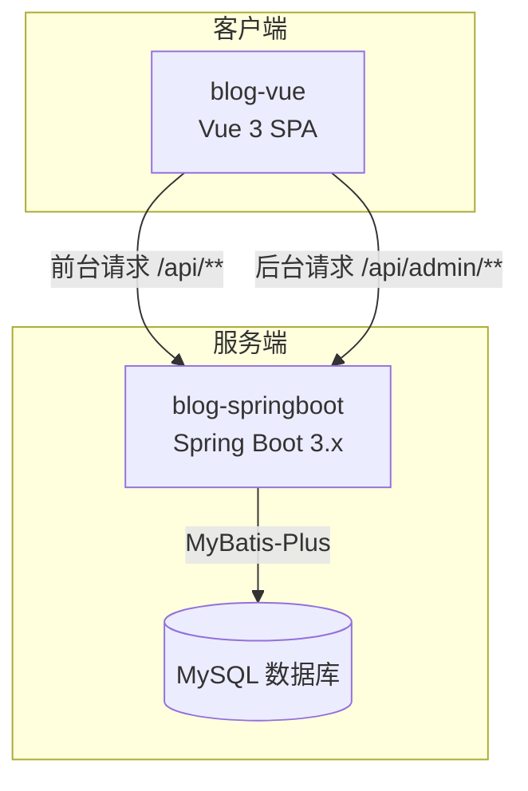
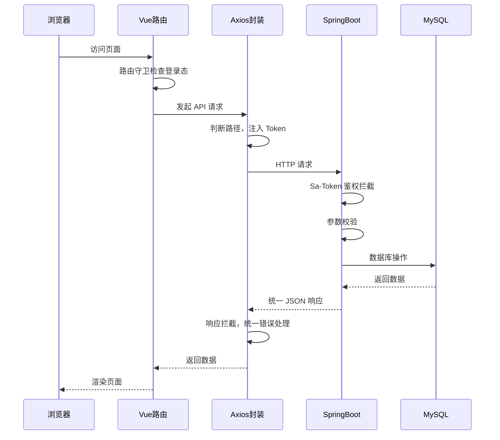

# 技术设计文档

## 概述

本文档描述个人博客系统的技术设计方案。系统采用前后端分离架构，由两个独立项目组成：

- **blog-springboot**：Spring Boot 3.x 后端应用，提供前台 API（`/api`）和后台 API（`/api/admin`），使用 MyBatis-Plus 操作 MySQL 数据库，Sa-Token 处理认证鉴权
- **blog-vue**：Vue 3 单页应用，使用 Vuetify + Tailwind CSS 构建 UI，通过路由前缀区分前台（`/`）和后台（`/admin`）

---

## 架构

### 整体架构图



### 请求流转示意



---

## 组件与接口

### blog-springboot 项目结构

```
blog-springboot/
├── src/main/java/com/blog/
│   ├── BlogApplication.java                  # 启动类
│   ├── common/                               # 公共模块
│   │   ├── result/
│   │   │   ├── Result.java                   # 统一响应体
│   │   │   └── ResultCode.java               # 业务错误码枚举
│   │   ├── exception/
│   │   │   ├── BusinessException.java        # 业务异常
│   │   │   └── GlobalExceptionHandler.java   # 全局异常处理器
│   │   ├── handler/
│   │   │   └── BlogMetaObjectHandler.java    # MyBatis-Plus 自动填充处理器
│   │   ├── interceptor/
│   │   │   └── RequestLogInterceptor.java    # 请求日志拦截器
│   │   └── utils/
│   │       └── PageUtils.java                # 分页工具类
│   ├── config/                               # 配置类
│   │   ├── SaTokenConfig.java                # Sa-Token 鉴权配置
│   │   ├── CorsConfig.java                   # CORS 跨域配置
│   │   ├── MybatisPlusConfig.java            # MyBatis-Plus 分页插件
│   │   └── WebMvcConfig.java                 # MVC 配置（注册拦截器）
│   ├── controller/
│   │   ├── frontend/                         # 前台控制器（/api）
│   │   │   ├── ArticleFrontController.java
│   │   │   ├── CategoryFrontController.java
│   │   │   ├── TagFrontController.java
│   │   │   └── CommentFrontController.java
│   │   └── admin/                            # 后台控制器（/api/admin）
│   │       ├── AuthAdminController.java
│   │       ├── ArticleAdminController.java
│   │       ├── CategoryAdminController.java
│   │       ├── TagAdminController.java
│   │       ├── CommentAdminController.java
│   │       └── DashboardAdminController.java
│   ├── service/
│   │   ├── ArticleService.java
│   │   ├── CategoryService.java
│   │   ├── TagService.java
│   │   ├── CommentService.java
│   │   └── impl/
│   │       ├── ArticleServiceImpl.java
│   │       ├── CategoryServiceImpl.java
│   │       ├── TagServiceImpl.java
│   │       └── CommentServiceImpl.java
│   ├── mapper/
│   │   ├── ArticleMapper.java
│   │   ├── CategoryMapper.java
│   │   ├── TagMapper.java
│   │   ├── ArticleTagMapper.java
│   │   └── CommentMapper.java
│   ├── entity/                               # 数据库实体
│   │   ├── BaseEntity.java                   # 审计字段抽象基类
│   │   ├── Admin.java
│   │   ├── Article.java
│   │   ├── Category.java
│   │   ├── Tag.java
│   │   ├── ArticleTag.java
│   │   └── Comment.java
│   ├── dto/                                  # 请求数据传输对象
│   │   ├── LoginDTO.java
│   │   ├── ArticleDTO.java
│   │   ├── CategoryDTO.java
│   │   ├── TagDTO.java
│   │   └── CommentDTO.java
│   └── vo/                                   # 响应视图对象
│       ├── ArticleVO.java
│       ├── ArticleListVO.java
│       ├── CategoryVO.java
│       ├── TagVO.java
│       ├── CommentVO.java
│       └── DashboardVO.java
└── src/main/resources/
    ├── application.yml
    └── mapper/                               # MyBatis XML 映射文件
```

### blog-vue 项目结构

```
blog-vue/
├── src/
│   ├── main.js                               # 入口文件
│   ├── App.vue                               # 根组件
│   ├── api/                                  # API 请求模块
│   │   ├── request.js                        # axios 封装
│   │   ├── article.js                        # 文章相关 API
│   │   ├── category.js                       # 分类相关 API
│   │   ├── tag.js                            # 标签相关 API
│   │   ├── comment.js                        # 评论相关 API
│   │   └── auth.js                           # 认证相关 API
│   ├── router/
│   │   └── index.js                          # 路由配置（含路由守卫）
│   ├── store/
│   │   └── auth.js                           # Pinia 用户登录态
│   ├── views/
│   │   ├── frontend/                         # 前台页面
│   │   │   ├── HomeView.vue                  # 首页
│   │   │   ├── ArticleDetailView.vue         # 文章详情
│   │   │   ├── CategoryView.vue              # 分类页
│   │   │   ├── TagView.vue                   # 标签页
│   │   │   ├── ArchiveView.vue               # 归档页
│   │   │   └── SearchView.vue                # 搜索页
│   │   └── admin/                            # 后台页面
│   │       ├── LoginView.vue                 # 登录页
│   │       ├── DashboardView.vue             # 仪表盘
│   │       ├── ArticleListView.vue           # 文章管理
│   │       ├── ArticleEditView.vue           # 文章编辑
│   │       ├── CategoryView.vue              # 分类管理
│   │       ├── TagView.vue                   # 标签管理
│   │       └── CommentView.vue               # 评论管理
│   └── components/                           # 公共组件
│       ├── frontend/
│       │   ├── ArticleCard.vue               # 文章卡片
│       │   ├── Pagination.vue                # 分页组件
│       │   └── CommentList.vue               # 评论列表
│       └── admin/
│           ├── AdminLayout.vue               # 后台布局（含侧边栏）
│           └── MarkdownEditor.vue            # Markdown 编辑器
```

### 核心 API 接口列表

#### 前台 API（`/api`，无需认证）

| 方法 | 路径 | 描述 |
|------|------|------|
| GET | `/api/articles` | 文章列表（分页，支持分类/标签/关键词筛选） |
| GET | `/api/articles/{id}` | 文章详情（同时增加阅读次数） |
| GET | `/api/categories` | 分类列表（含文章数量） |
| GET | `/api/categories/{id}/articles` | 指定分类下的文章列表 |
| GET | `/api/tags` | 标签列表（含文章数量） |
| GET | `/api/tags/{id}/articles` | 指定标签下的文章列表 |
| GET | `/api/articles/archive` | 归档数据（按年月分组） |
| POST | `/api/comments` | 提交评论 |
| GET | `/api/articles/{id}/comments` | 文章评论列表（仅已通过） |

#### 后台 API（`/api/admin`，需要 Sa-Token 认证）

| 方法 | 路径 | 描述 |
|------|------|------|
| POST | `/api/admin/auth/login` | 管理员登录 |
| POST | `/api/admin/auth/logout` | 管理员登出 |
| GET | `/api/admin/dashboard` | 仪表盘统计数据 |
| GET | `/api/admin/articles` | 文章列表（含草稿，分页） |
| POST | `/api/admin/articles` | 创建文章 |
| PUT | `/api/admin/articles/{id}` | 更新文章 |
| DELETE | `/api/admin/articles/{id}` | 删除文章（软删除） |
| GET | `/api/admin/categories` | 分类列表 |
| POST | `/api/admin/categories` | 创建分类 |
| PUT | `/api/admin/categories/{id}` | 更新分类 |
| DELETE | `/api/admin/categories/{id}` | 删除分类 |
| GET | `/api/admin/tags` | 标签列表 |
| POST | `/api/admin/tags` | 创建标签 |
| PUT | `/api/admin/tags/{id}` | 更新标签 |
| DELETE | `/api/admin/tags/{id}` | 删除标签 |
| GET | `/api/admin/comments` | 评论列表（支持状态筛选，分页） |
| PUT | `/api/admin/comments/{id}/approve` | 审核通过评论 |
| PUT | `/api/admin/comments/{id}/reject` | 拒绝评论 |
| DELETE | `/api/admin/comments/{id}` | 删除评论 |

---

## 数据模型

### 数据库表结构

#### admin（管理员表）

```sql
CREATE TABLE admin (
    id          BIGINT PRIMARY KEY AUTO_INCREMENT COMMENT '主键 ID',
    username    VARCHAR(50) NOT NULL UNIQUE COMMENT '用户名',
    password    VARCHAR(100) NOT NULL COMMENT '密码（BCrypt 加密）',
    create_time DATETIME COMMENT '创建时间',
    create_by   VARCHAR(50) COMMENT '创建人',
    update_time DATETIME COMMENT '更新时间',
    update_by   VARCHAR(50) COMMENT '更新人'
) COMMENT '管理员表';
```

#### category（分类表）

```sql
CREATE TABLE category (
    id          BIGINT PRIMARY KEY AUTO_INCREMENT COMMENT '主键 ID',
    name        VARCHAR(50) NOT NULL UNIQUE COMMENT '分类名称',
    description VARCHAR(200) COMMENT '分类描述',
    create_time DATETIME COMMENT '创建时间',
    create_by   VARCHAR(50) COMMENT '创建人',
    update_time DATETIME COMMENT '更新时间',
    update_by   VARCHAR(50) COMMENT '更新人'
) COMMENT '分类表';
```

#### tag（标签表）

```sql
CREATE TABLE tag (
    id          BIGINT PRIMARY KEY AUTO_INCREMENT COMMENT '主键 ID',
    name        VARCHAR(50) NOT NULL UNIQUE COMMENT '标签名称',
    create_time DATETIME COMMENT '创建时间',
    create_by   VARCHAR(50) COMMENT '创建人',
    update_time DATETIME COMMENT '更新时间',
    update_by   VARCHAR(50) COMMENT '更新人'
) COMMENT '标签表';
```

#### article（文章表）

```sql
CREATE TABLE article (
    id          BIGINT PRIMARY KEY AUTO_INCREMENT COMMENT '主键 ID',
    title       VARCHAR(200) NOT NULL COMMENT '文章标题',
    content     LONGTEXT NOT NULL COMMENT '文章正文（Markdown）',
    summary     VARCHAR(500) COMMENT '文章摘要',
    cover_url   VARCHAR(500) COMMENT '封面图片 URL',
    category_id BIGINT COMMENT '所属分类 ID',
    status      TINYINT NOT NULL DEFAULT 0 COMMENT '发布状态：0=草稿，1=已发布',
    view_count  INT NOT NULL DEFAULT 0 COMMENT '阅读次数',
    deleted     TINYINT NOT NULL DEFAULT 0 COMMENT '软删除标志：0=正常，1=已删除',
    create_time DATETIME COMMENT '创建时间',
    create_by   VARCHAR(50) COMMENT '创建人',
    update_time DATETIME COMMENT '更新时间',
    update_by   VARCHAR(50) COMMENT '更新人',
    FOREIGN KEY (category_id) REFERENCES category(id) ON DELETE SET NULL
) COMMENT '文章表';
```

#### article_tag（文章标签关联表）

```sql
CREATE TABLE article_tag (
    article_id  BIGINT NOT NULL COMMENT '文章 ID',
    tag_id      BIGINT NOT NULL COMMENT '标签 ID',
    PRIMARY KEY (article_id, tag_id),
    FOREIGN KEY (article_id) REFERENCES article(id) ON DELETE CASCADE,
    FOREIGN KEY (tag_id) REFERENCES tag(id) ON DELETE CASCADE
) COMMENT '文章标签关联表';
```

#### comment（评论表）

```sql
CREATE TABLE comment (
    id          BIGINT PRIMARY KEY AUTO_INCREMENT COMMENT '主键 ID',
    article_id  BIGINT NOT NULL COMMENT '所属文章 ID',
    nickname    VARCHAR(50) NOT NULL COMMENT '评论者昵称',
    email       VARCHAR(100) COMMENT '评论者邮箱（可选）',
    content     TEXT NOT NULL COMMENT '评论内容',
    status      TINYINT NOT NULL DEFAULT 0 COMMENT '审核状态：0=待审核，1=已通过，2=已拒绝',
    create_time DATETIME COMMENT '评论时间',
    create_by   VARCHAR(50) COMMENT '创建人（访客填 visitor）',
    update_time DATETIME COMMENT '更新时间',
    update_by   VARCHAR(50) COMMENT '更新人',
    FOREIGN KEY (article_id) REFERENCES article(id) ON DELETE CASCADE
) COMMENT '评论表';
```

### 核心 Java 实体示例

```java
// 审计字段抽象基类，所有业务实体继承此类
@Data
public abstract class BaseEntity {
    // 创建时间，INSERT 时自动填充
    @TableField(fill = FieldFill.INSERT)
    private LocalDateTime createTime;

    // 创建人，INSERT 时自动填充（管理员用户名或 "visitor"）
    @TableField(fill = FieldFill.INSERT)
    private String createBy;

    // 更新时间，INSERT 和 UPDATE 时自动填充
    @TableField(fill = FieldFill.INSERT_UPDATE)
    private LocalDateTime updateTime;

    // 更新人，INSERT 和 UPDATE 时自动填充（管理员用户名或 "visitor"）
    @TableField(fill = FieldFill.INSERT_UPDATE)
    private String updateBy;
}
```

```java
// 文章实体（使用 MyBatis-Plus 注解，继承 BaseEntity 获得审计字段）
@Data
@EqualsAndHashCode(callSuper = true)
@TableName("article")
public class Article extends BaseEntity {
    @TableId(type = IdType.AUTO)
    private Long id;
    private String title;
    private String content;
    private String summary;
    private String coverUrl;
    private Long categoryId;
    // 发布状态：0=草稿，1=已发布
    private Integer status;
    private Integer viewCount;
    // 软删除字段，MyBatis-Plus 自动过滤 deleted=1 的记录
    @TableLogic
    private Integer deleted;
}
```

### 自动填充设计

MyBatis-Plus 通过 `MetaObjectHandler` 接口实现审计字段的自动填充，无需在每次数据库操作时手动赋值。

**实现类**：`com.blog.common.handler.BlogMetaObjectHandler`

**填充规则**：

| 字段 | INSERT 时 | UPDATE 时 |
|------|-----------|-----------|
| `create_time` | 填充 `LocalDateTime.now()` | 不填充 |
| `create_by` | 填充当前用户名或 `"visitor"` | 不填充 |
| `update_time` | 填充 `LocalDateTime.now()` | 填充 `LocalDateTime.now()` |
| `update_by` | 填充当前用户名或 `"visitor"` | 填充当前用户名或 `"visitor"` |

**用户名获取逻辑**：通过 Sa-Token 的 `StpUtil.isLogin()` 判断当前会话是否存在登录用户：
- 后台管理操作（已登录）：填充 `StpUtil.getLoginId()` 返回的管理员用户名
- 前台访客操作（未登录，如提交评论）：填充固定值 `"visitor"`

```java
// MyBatis-Plus 自动填充处理器
@Component
public class BlogMetaObjectHandler implements MetaObjectHandler {

    @Override
    public void insertFill(MetaObject metaObject) {
        // 填充创建时间和更新时间
        this.strictInsertFill(metaObject, "createTime", LocalDateTime.class, LocalDateTime.now());
        this.strictInsertFill(metaObject, "updateTime", LocalDateTime.class, LocalDateTime.now());
        // 填充创建人和更新人：有登录用户取用户名，否则填 "visitor"
        String currentUser = getCurrentUser();
        this.strictInsertFill(metaObject, "createBy", String.class, currentUser);
        this.strictInsertFill(metaObject, "updateBy", String.class, currentUser);
    }

    @Override
    public void updateFill(MetaObject metaObject) {
        // 填充更新时间和更新人
        this.strictUpdateFill(metaObject, "updateTime", LocalDateTime.class, LocalDateTime.now());
        this.strictUpdateFill(metaObject, "updateBy", String.class, getCurrentUser());
    }

    /**
     * 获取当前操作用户名
     * 后台管理操作：返回 Sa-Token 登录用户名
     * 前台访客操作（如提交评论）：返回 "visitor"
     */
    private String getCurrentUser() {
        try {
            if (StpUtil.isLogin()) {
                return (String) StpUtil.getLoginId();
            }
        } catch (Exception ignored) {
            // Sa-Token 未初始化或上下文不存在时忽略
        }
        return "visitor";
    }
}
```

### 统一响应体

```java
// 统一响应体 Result<T>
@Data
public class Result<T> {
    // 业务状态码
    private Integer code;
    // 描述信息
    private String message;
    // 业务数据
    private T data;

    public static <T> Result<T> success(T data) {
        Result<T> result = new Result<>();
        result.setCode(200);
        result.setMessage("success");
        result.setData(data);
        return result;
    }

    public static <T> Result<T> error(ResultCode resultCode) {
        Result<T> result = new Result<>();
        result.setCode(resultCode.getCode());
        result.setMessage(resultCode.getMessage());
        return result;
    }
}
```

### 业务错误码枚举

```java
// 业务错误码枚举
public enum ResultCode {
    SUCCESS(200, "success"),
    BAD_REQUEST(400, "请求参数错误"),
    UNAUTHORIZED(401, "未登录或登录已过期"),
    FORBIDDEN(403, "无权限访问"),
    NOT_FOUND(404, "资源不存在"),
    INTERNAL_ERROR(500, "服务器内部错误"),
    // 业务错误码（从 1000 开始）
    USERNAME_OR_PASSWORD_ERROR(1001, "用户名或密码错误"),
    CATEGORY_NAME_DUPLICATE(1002, "分类名称已存在"),
    TAG_NAME_DUPLICATE(1003, "标签名称已存在"),
    CATEGORY_HAS_ARTICLES(1004, "该分类下存在文章，无法删除"),
    ARTICLE_TITLE_REQUIRED(1005, "文章标题不能为空"),
    ARTICLE_CONTENT_REQUIRED(1006, "文章正文不能为空");

    private final Integer code;
    private final String message;
}
```

### 分页响应结构

```json
{
  "code": 200,
  "message": "success",
  "data": {
    "total": 100,
    "pages": 10,
    "list": [ ... ]
  }
}
```

---

## 正确性属性

*属性（Property）是在系统所有合法执行中都应成立的特征或行为——本质上是对系统应做什么的形式化陈述。属性是人类可读规范与机器可验证正确性保证之间的桥梁。*

### 属性 1：软删除后访客不可见

*对任意* 已发布文章，执行软删除操作后，访客通过前台 API 查询文章列表或文章详情，均不应返回该文章

**验证需求：需求 2.6、需求 2.9**

### 属性 2：含文章的分类不可删除

*对任意* 分类，若该分类下存在至少一篇文章（无论发布状态），则删除该分类的操作应被拒绝并返回错误

**验证需求：需求 3.4**

### 属性 3：评论初始状态为待审核

*对任意* 合法的评论提交请求（包含昵称和评论内容），提交成功后该评论的状态应为"待审核"（status=0），且前台查询不应返回该评论

**验证需求：需求 5.3、需求 5.4**

### 属性 4：评论审核状态流转合法性

*对任意* 待审核评论，审核通过后状态应变为"已通过"（status=1）且前台可见；审核拒绝后状态应变为"已拒绝"（status=2）且前台不可见

**验证需求：需求 5.4、需求 5.5、需求 5.6**

### 属性 5：分页查询结果一致性

*对任意* 合法的 pageNum 和 pageSize 参数，分页查询返回的 list 长度不超过 pageSize，且 total 与实际数据总量一致

**验证需求：需求 2.11、需求 9.12、需求 9.13**

### 属性 6：Token 过期后接口拒绝访问

*对任意* 已过期或无效的 Token，请求任意 `/api/admin/**` 接口均应返回 HTTP 401，且不执行业务逻辑

**验证需求：需求 1.6、需求 1.7**

### 属性 7：统一响应结构完整性

*对任意* 后台或前台 API 请求（无论成功或失败），响应体均应包含 `code`、`message`、`data` 三个字段，且 `code` 为整数

**验证需求：需求 9.1、需求 10.1**

### 属性 8：axios 请求 Token 注入规则

*对任意* 以 `/api/admin` 开头的请求，axios 封装应自动注入 Token 请求头；对任意以 `/api` 开头但不以 `/api/admin` 开头的请求，不注入 Token

**验证需求：需求 11.5**

---

## 错误处理

### 后端全局异常处理

```java
// 全局异常处理器
@RestControllerAdvice
public class GlobalExceptionHandler {

    // 处理业务异常，HTTP 状态码保持 200
    @ExceptionHandler(BusinessException.class)
    public Result<Void> handleBusinessException(BusinessException e) {
        log.warn("业务异常: {}", e.getMessage());
        return Result.error(e.getResultCode());
    }

    // 处理参数校验异常（@Valid 触发），返回 code=400
    @ExceptionHandler(MethodArgumentNotValidException.class)
    public Result<Void> handleValidationException(MethodArgumentNotValidException e) {
        String message = e.getBindingResult().getFieldErrors()
            .stream()
            .map(FieldError::getDefaultMessage)
            .collect(Collectors.joining(", "));
        return Result.error(ResultCode.BAD_REQUEST.withMessage(message));
    }

    // 处理资源不存在异常，返回 code=404
    @ExceptionHandler(ResourceNotFoundException.class)
    public Result<Void> handleNotFoundException(ResourceNotFoundException e) {
        return Result.error(ResultCode.NOT_FOUND);
    }

    // 处理未捕获系统异常，返回 code=500，记录完整堆栈
    @ExceptionHandler(Exception.class)
    public Result<Void> handleException(Exception e) {
        log.error("系统异常", e);
        return Result.error(ResultCode.INTERNAL_ERROR);
    }
}
```

### 前端错误处理

```javascript
// axios 响应拦截器统一错误处理
instance.interceptors.response.use(
  response => {
    var data = response.data;
    // 业务错误（code 非 200）
    if (data.code !== 200) {
      // 401：清除登录态并跳转登录页
      if (data.code === 401) {
        authStore.clearAuth();
        router.push('/admin/login');
        return Promise.reject(new Error('登录已过期'));
      }
      // 其他错误：toast 提示
      showToast(data.message || '操作失败');
      return Promise.reject(new Error(data.message));
    }
    return data;
  },
  error => {
    // 网络错误或服务器异常
    showToast('网络异常，请稍后重试');
    return Promise.reject(error);
  }
);
```

### 错误场景汇总

| 场景 | HTTP 状态码 | 响应 code | 处理方式 |
|------|------------|-----------|---------|
| 参数校验失败 | 200 | 400 | 返回具体字段错误信息 |
| 未登录/Token 过期 | 200 | 401 | 前端跳转登录页 |
| 资源不存在 | 200 | 404 | 返回资源不存在提示 |
| 业务逻辑错误 | 200 | 1xxx | 返回具体业务错误描述 |
| 系统未捕获异常 | 200 | 500 | 返回通用错误提示，后端记录堆栈 |

---

## 测试策略

### 双轨测试方法

本系统同时采用单元测试和属性测试，两者互补：

- **单元测试**：验证具体示例、边界条件和错误场景
- **属性测试**：验证跨所有输入的通用属性（使用 jqwik 框架）

### 后端测试

**属性测试框架**：[jqwik](https://jqwik.net/)（Java 属性测试库，最低 100 次迭代）

每个属性测试使用注释标注对应的设计属性：

```java
// Feature: personal-blog-system, Property 1: 软删除后访客不可见
@Property(tries = 100)
void 软删除后访客查询不到该文章(@ForAll @From("validArticle") Article article) {
    // 创建文章 -> 软删除 -> 前台查询 -> 验证不存在
}
```

**单元测试覆盖重点**：
- Service 层业务逻辑（分类删除约束、评论状态流转）
- Controller 层参数校验
- 全局异常处理器各分支
- Sa-Token 鉴权拦截器

**集成测试**：
- 使用 H2 内存数据库或 Testcontainers 运行 MySQL
- 覆盖完整请求链路（Controller → Service → Mapper → DB）

### 前端测试

**属性测试框架**：[fast-check](https://fast-check.io/)（JavaScript 属性测试库）

```javascript
// Feature: personal-blog-system, Property 8: axios Token 注入规则
test('axios 根据路径自动注入 Token', () => {
  fc.assert(fc.property(
    fc.string().filter(s => s.startsWith('/api/admin')),
    (path) => {
      // 验证 /api/admin 路径请求包含 Authorization 头
    }
  ), { numRuns: 100 });
});
```

**单元测试覆盖重点**：
- axios 封装的 Token 注入逻辑（属性 8）
- 路由守卫重定向逻辑（属性 6 前端侧）
- Pinia store 登录态管理

### 属性测试配置要求

- 每个属性测试最少运行 **100 次迭代**
- 每个属性测试必须通过注释引用设计文档中的对应属性
- 注释格式：`Feature: personal-blog-system, Property {编号}: {属性描述}`
- 每个正确性属性对应一个属性测试用例
